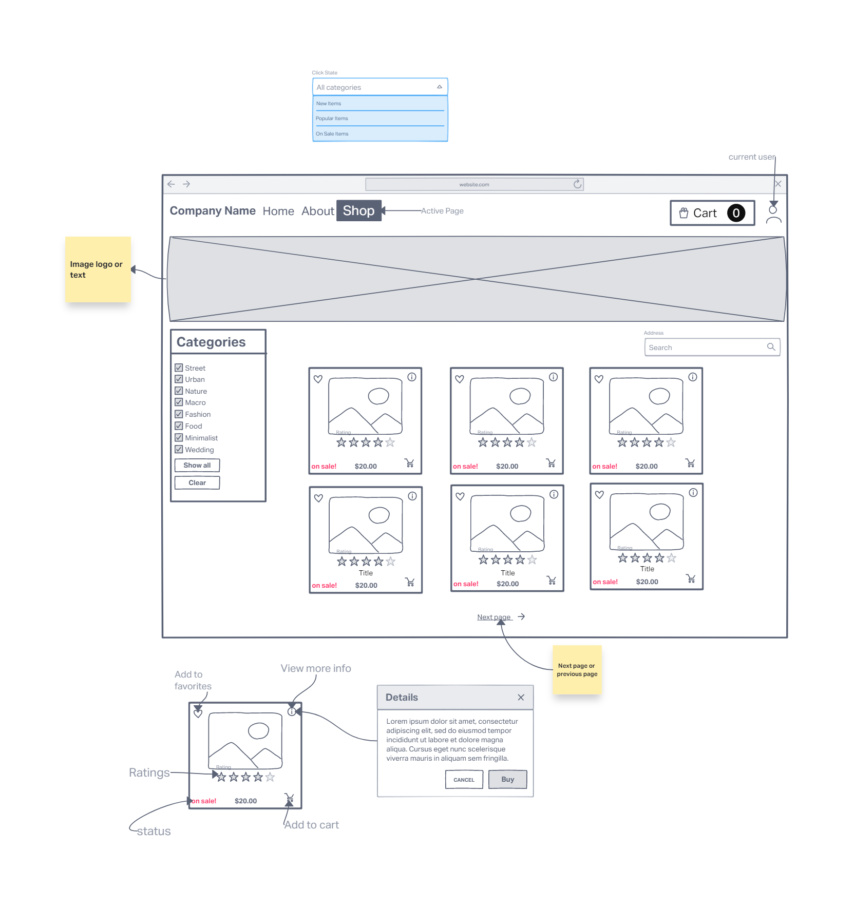
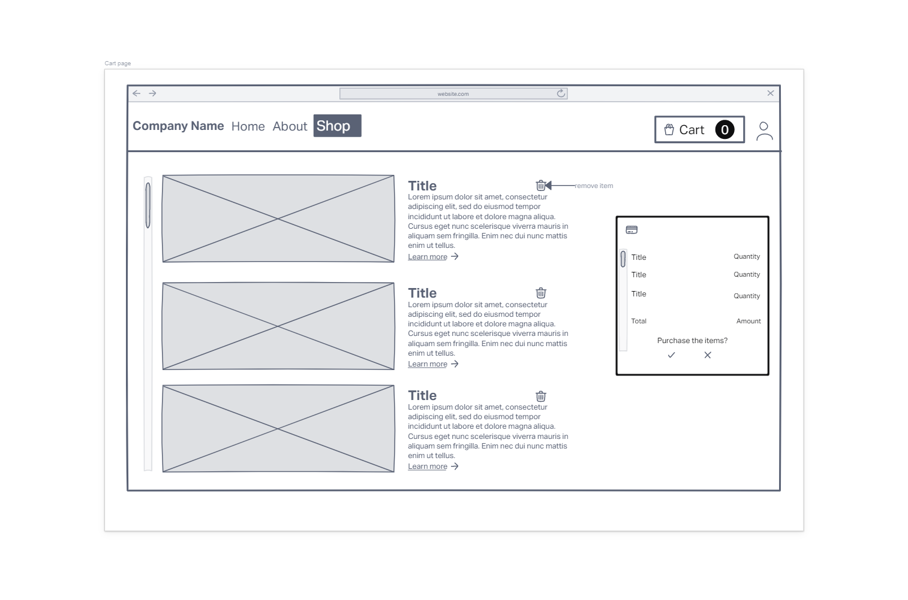
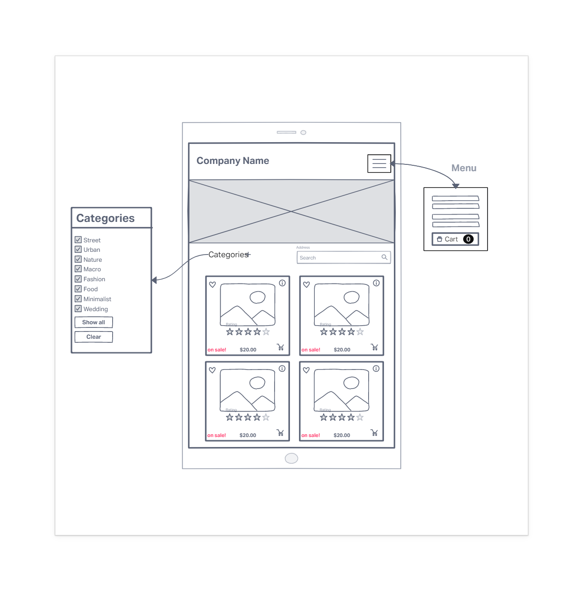

# eCommerce-Landing-Page
 Academic Project for Internet Programming Course

# Description
- To demonstrate our knowledge in web development we are given the task of creating an online store using pure JavaScript, HTML and CSS. It will also demonstrate our knowledge in bootstrap and other web framework.
- It is an online store selling specific items. The items can be sorted and organized by categories. The user can browse the list of available items. Additionally, the user can use the search bar to look for an specific item. The user can press *view more details* option to reveal more info about the item. The user can add the items to the cart or remove it. 

# Learning Objectives
- The main focus of the work to be done in the assignment is the use of **JavaScript** objects and **arrays**. However, this assignment involves the use of, but not limited to, the following:
  - Event-driven programming paradigm: using JavaScript
    Dynamic access to, and change the content of, HTML elements and their attributes
  - DOM (Document Object Model) API
  - Public JavaScript functions and objects
  - An open source CSS framework: (*Bootstrap*)
  - An open source vector-based icons framework: (*Font Awesome*)
- # TODO List
- Check this [link](TODO.md) to see the TODO list.

# PROTOTYPE WEBSITE

[LIVE](https://ecom-photography-store.netlify.app)

# WireFrame
## Desktop

## Mobile version

